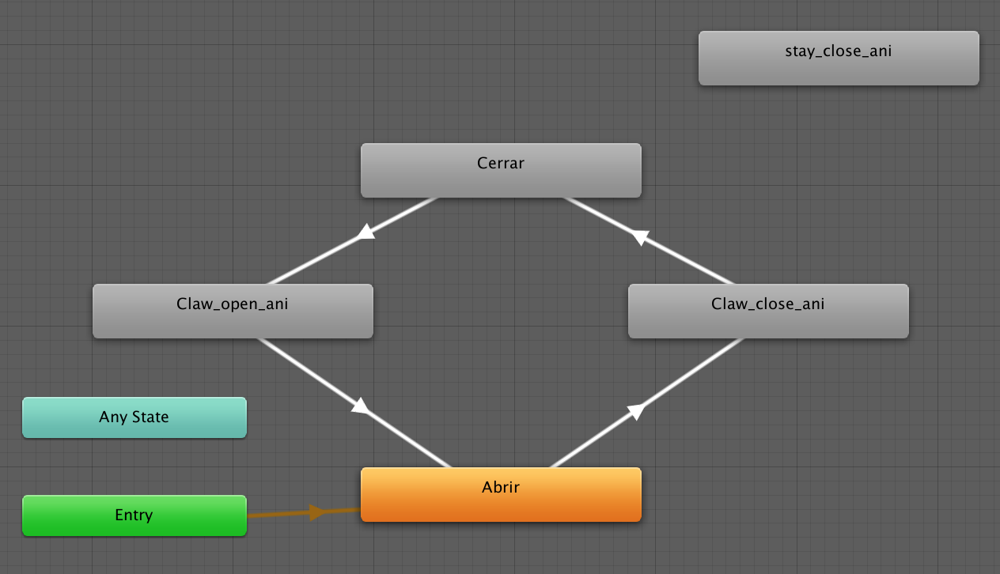
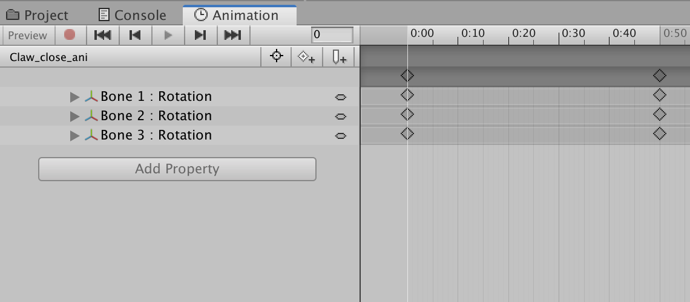
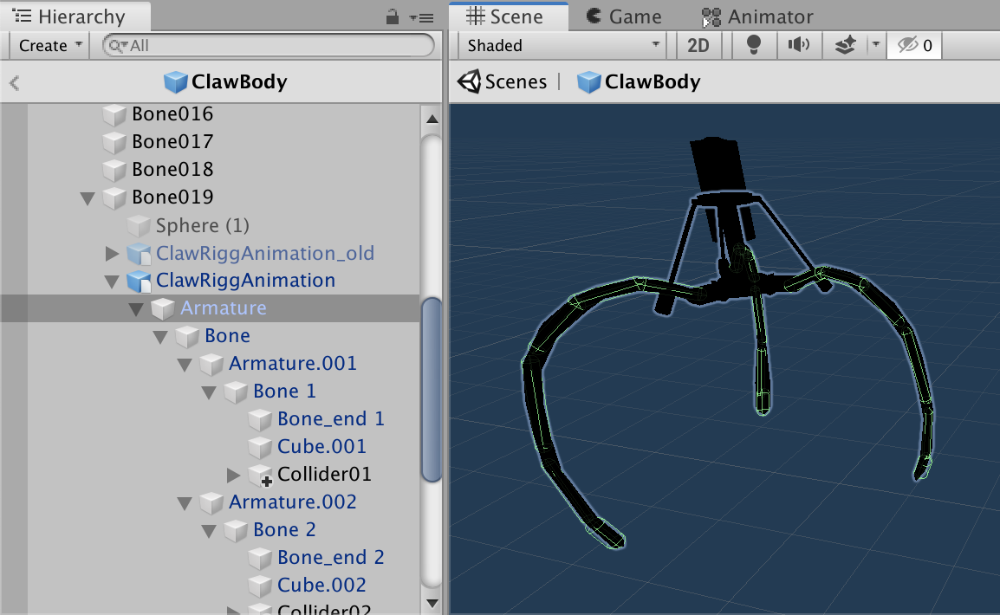
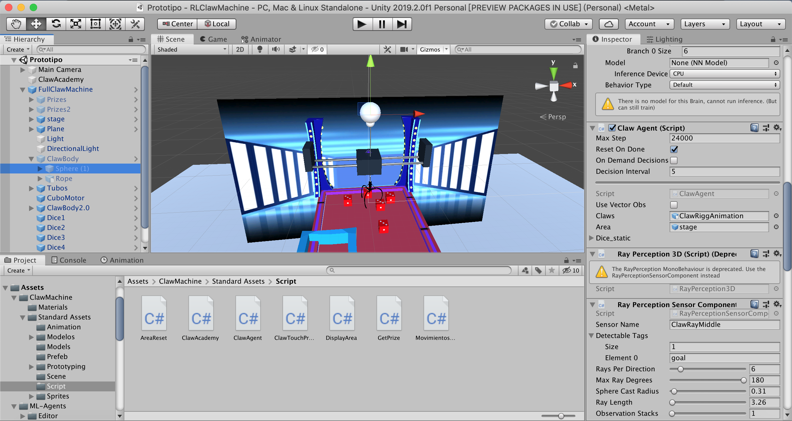

# Claw Machine - How To Build From Start

以下為打造此專題的步驟，從夾娃娃機遊戲開始，製作成強化式機器學習的環境，並訓練agent、製造模型。

## 步驟一：下載環境與 ml-agent

#### 先將遊戲環境clone下來
```
git clone https://github.com/czazuaga/Claw_Machine_Simulator.git
```    
將 Claw Machine Proyect 解壓縮，`Claw Machine Proyect/Assets`放進新建的 Unity 專案的 Assets之下。    
#### 下載最新版本的ml-agents
```
git clone --branch latest_release https://github.com/Unity-Technologies/ml-agents.git
```  
⁨把`ml-agents-master⁩/UnitySDK⁩/⁨Assets⁩/ML-Agents⁩`放進新建的 Unity 專案的 Assets 之下。


## 步驟二：重建 Claw_Machine_Simulator

[Original Claw_Machine_Simulator](https://github.com/czazuaga/Claw_Machine_Simulator) By czazuaga    
原作者使用的 unity 版本與我們使用的不相符，開啟後會產生很多錯誤，如動畫消失、模型分離、碰撞失效，而且之後要將環境改造成適合 ml-agents 使用，因此要先將遊戲稍作修復與修改。 

* **Animator & Animation 動畫製作**    
    

當爪子關閉時，`SetBool("Abrir", false)`且`SetBool("Cerrar", true)`，`Claw_close_ani`會被呼叫，而該動畫的配置如下，開始為爪子張開的狀態(三根爪子的 rotation 為x:135)，0.5秒後爪子是閉合的狀態(三根爪子的 rotation 為x:95)。  
當爪子開啟時，`SetBool("Abrir", true)`且`SetBool("Cerrar", false)`，`Claw_open_ani`會被呼叫，與上方爪子關閉的操作相反。   
     
    
* **建造爪子與Collider**
多個 Capsule Collider 沿著爪子排列，讓爪子不會穿透物體，能夠與獎品產生碰撞。因為 Mesh Collider 損毀，因此用這種方法代替。   
原始爪子物件損毀，將模型重新放入 Scene 之中，設定 MovimientosClaw.cs 的參數。  

      

* **其他細部調整**
為各個物件建立 Prefeb，以便複製與更改。    
含有 collider 的獎品部件需要加上 Prize 的 tag，以便之後偵測獎品進洞與獎品碰撞。    
要在機台四周加上不含 mesh 、含有 Collider 的平面，防止物件從中央彈出。    
改寫 MovimientosClaw ，讓爪子在放下獎品後會回到中央。

## 步驟三：增加 ml-agents 的函數與物件

    

* 在 Claw Body 物件中的 Sphere 加入 Script `ClawAgent.cs` 與 `Behavior Parameters`。   
* 創造空物件 ClawAcademy ，加入 `ClawAcademy.cs`。
* Claw Body/Rope/Bone019/ClawRiggAnimation中加入 `ClawTouchPrize.cs`。
* 在 stage 物件中加入平面，當獎品與平面發生碰撞，呼叫 `GetPrize.cs` 的 OnTriggerEnter。    
* 在 Main Camera/Canvas 之中加上 Text 與 `DisplayArea.cs`，紀錄獎品進洞所獲得的 reward 跟 step 。
* stage 中加入 `AreaReset.cs` 以便在到達 MaxStep 時重置環境。

**其他詳細程式碼解釋與訓練方法，會在README中講解。**
