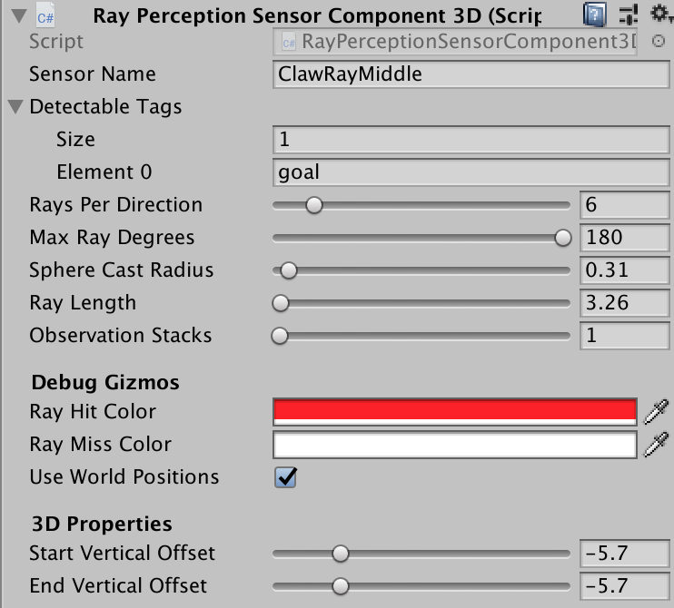
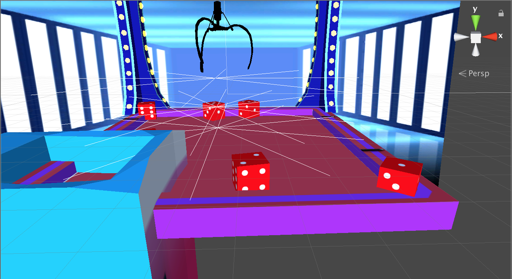

# RLClawMachine 強化式機器學習期末專題

此專題的目標是製作一個自動夾娃娃機器人，利用 [czazuaga](https://github.com/czazuaga) 所製作的 unity Claw_Machine_Simulator，加上 unity 的 ml-agents，來訓練夾娃娃機自動夾取獎品。可以參考 Unity-Technologies
/ml-agents 的官方文件與線上教學，來進一步了解 ml-agent 的運作方式。    
unity version: 2019.2.0f1    
ml-agent version: ML-Agents Beta 0.12.0     

## Documentation

* 學習從頭打造自動夾娃娃機，[文件在此](BuildFromStart.md)
* 原始的夾娃娃機遊戲 [Claw_Machine_Simulator](https://github.com/czazuaga/Claw_Machine_Simulator)
* [Ml-agents](https://github.com/Unity-Technologies/ml-agents)官方文件
* 莫凡的講解 [Proximal Policy Optimization](https://morvanzhou.github.io/tutorials/machine-learning/reinforcement-learning/6-4-DPPO/)(PPO)

## 不同 Version 的嘗試

**第一版**：    
使用舊版 Ray Perception 3D，useVectorObs可以開啟(1)或關閉(0)射線。另外會觀察 Agent 的絕對位置。    
```c#
    // 三組射線角度
    float[] rayAngles = { 0f, 30f, 60f, 90f, 120f, 150f, 180f, 210f, 240f, 270f, 300f, 330f };
    float[] rayAngles1 = { 15f, 45f, 75f, 105f, 135f, 165f, 195f, 225f, 255f, 285f, 315f, 345f };
    float[] rayAngles2 = { 5f, 25f, 45f, 65f, 85f, 100f };

    // 需要偵測的物件tag
    string[] detectableObjects = {"goal"};
    AddVectorObs(m_RayPer.Perceive(2.2f, rayAngles, detectableObjects, -3f, -6f));
    AddVectorObs(m_RayPer.Perceive(1.4f, rayAngles1, detectableObjects, -3.5f, -6.5f));
    AddVectorObs(m_RayPer.Perceive(4.7f, rayAngles2, detectableObjects, -3.5f, -6.5f));
```
獎品進到洞口，增加 reward(2)；在不跑動畫時，每步減少 reward(-1/MaxStep)。    
MaxStep 為8000， 未更改 yaml 檔案中的數據。    

**第二版**：    
使用新版 Ray Perception Sensor Component 3D，形狀為倒傘狀，共有兩層，另外在右上方還有額外的偵測射線，去掉偵測 Agent 的絕對位置。    
MaxStep 為16000，每步減少 reward(-1/MaxStep)改成在所有時刻都發生。    
爪子在放下獎品後會回到中央，避免在洞口徘徊過長的時間。    

**第三版**：    
Ray Perception Sensor Component 3D形狀改為三層平面，各層有8條射線，三層各自有不同角度。    
MaxStep 為24000，爪子碰撞獎品時會增加 reward(0.05)，以利 agent 學習到要靠近爪子。    
獎品從各式形狀的物品改成固定的骰子，每次重置場景時，6顆骰子會隨機的在場上落下，以確保訓練的多樣性。
    
    
    

**第四版**：
去掉所有射線，改成收集獎品骰子的位置(x, y, z)，與爪子的位置做相減。    
場上骰子改為5顆(有嘗試1顆骰子，效果較為不優)，並在落下獎品洞口或是掉出場外一定高度後，會再度隨機擺回場上。

